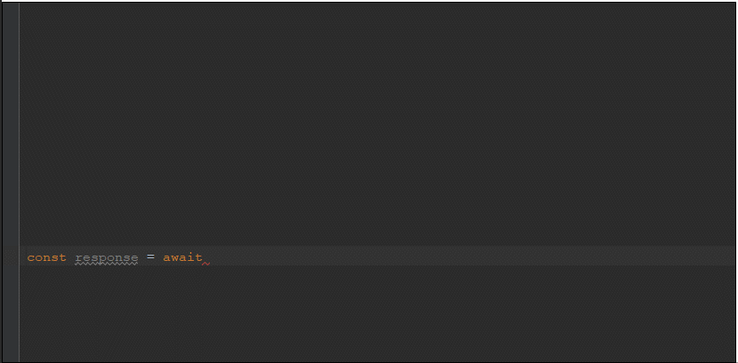

# Swagger to Typescript Codegen

[](https://travis-ci.com/mtennoe/swagger-typescript-codegen)

This package generates a TypeScript class from a [swagger specification file](https://github.com/wordnik/swagger-spec). The code is generated using [handlebars templates](https://handlebarsjs.com) and some [helpers](https://github.com/helpers/handlebars-helpers).
Quality is checked by [jshint](https://github.com/jshint/jshint/) and beautified by [js-beautify](https://github.com/beautify-web/js-beautify).

The typescript generator is based on [axios](https://github.com/axios/axios) and can be used for both nodejs and the browser via browserify/webpack.

This fork improvements:

- [x] Change template engine to more powerful handlebars
- [x] Move more logic to template
- [x] Change http client to [axios](https://github.com/axios/axios)
- [x] Add support for grouping methods by swagger tags
- [x] Custom parsing function for method name & namespace
- [x] Custom extra templates
- [x] Generate code contains exported api interface
- [x] Each method has optional `config` parameter, which can override base request - [AxiosRequestConfig](https://github.com/axios/axios#request-config)

To do:

- [ ] Fix cli
- [ ] Add example usage with Vue, Nuxt, React

## Installation

```bash
npm install swagger-ts-codegen
```

## Examples

### Generator - basic

```javascript
const fs = require("fs");
const path = require("path");
const { CodeGen } = require("swagger-ts-codegen");

const file = path.resolve("./swagger/spec.json");
const swaggerSpec = JSON.parse(fs.readFileSync(file, "UTF-8"));

const tsSourceCode = CodeGen.generateCode({
  swagger: swaggerSpec
});

const outputFile = path.join(__dirname, "api.ts");
fs.writeFileSync(outputFile, tsSourceCode, { encoding: "UTF-8" });
```

### Generator - custom template

```javascript
const tsSourceCode = CodeGen.generateCode({
  swagger: swaggerSpec,
  template: {
    method: path.resolve("./my-method.hbs"),
    anyCustomPartialTemplate: path.resolve("./my-js-doc.hbs")
    //available via {{> anyCustomPartialTemplate}} in all templates
  }
});
```

### Generated api usage (web)



```typescript
import axios from "axios";
import { createApi } from "./api.ts";

const api = createApi();

// or pass axiosInstance

const httpClient = axios.create({
  baseURL: "http://swagger.io/api" //override domain form swagger spec
});

//additional client setup
httpClient.defaults.timeout = 1000;
//[...]

const api2 = createApi(httpClient);

async function getUsers() {
  const { data: users } = await api.userResource.get();
  // or
  const users2 = await api.userResource.$get();
}
```

## Options

- `swagger` - Swagger object \
  Type: `object` \
  Required `true`

- `template` - Absolute paths to templates (provided object is merged with default) \
  Type: `object` \
  Default: `{main: ..., type: ..., method: ..., interface: ...}`

- `imports` - Typescript definition files to be imported \
  Type: `array` \
  Default: `[]`

- `hbsContext` - Custom variables injected to templates \
  Type: `object` \
  Default: `{}`

- `getNamespace` - Custom parsing function \
  Type: `Function` `getNamespace(tag: string) : string` \
  Default: `tag => _.camelCase(tag)`

- `getMethodName` - Custom parsing function \
  Type: `Function` `getMethodName(op: HttpOperation, httpVerb: string, path: string) : string` \
  [HttpOperation](https://swagger.io/specification/#operationObject) \
  Default: `(op, httpVerb, path) => op.operationId || ...`

- `beautify` - Whether or not to beautify the generated code \
  Type: `boolean` \
  Default: `true`

- `beautifyOptions` - Options to be passed to the beautify command. See js-beautify for all available options. \
  Type: `object` \
  Default: `{indent_size: 4, max_preserve_newlines: 2}`

### Template Variables

The following data are passed to the [hbs templates](https://handlebarsjs.com):

```yaml
isES6:
  type: boolean
description:
  type: string
  description: Provided by your options field: 'swagger.info.description'
isSecure:
  type: boolean
  description: false unless 'swagger.securityDefinitions' is defined
domain:
  type: string
  description: If all options defined: swagger.schemes[0] + '://' + swagger.host + swagger.basePath
methods:
  type: array
  items:
    type: object
    properties:
      path:
        type: string
      pathFormatString:
        type: string
      className:
        type: string
        description: Provided by your options field
      methodName:
        type: string
        description: Generated from the HTTP method and path elements or 'x-swagger-js-method-name' field
      method:
        type: string
        description: 'GET', 'POST', 'PUT', 'DELETE', 'PATCH', 'COPY', 'HEAD', 'OPTIONS', 'LINK', 'UNLINK', 'PURGE', 'LOCK', 'UNLOCK', 'PROPFIND'
      isGET:
        type: string
        description: true if method === 'GET'
      summary:
        type: string
        description: Provided by the 'description' or 'summary' field in the schema
      externalDocs:
        type: object
        properties:
          url:
            type: string
            description: The URL for the target documentation. Value MUST be in the format of a URL.
            required: true
          description:
            type: string
            description: A short description of the target documentation. GitHub-Markdown syntax can be used for rich text representation.
      isSecure:
        type: boolean
        description: true if the 'security' is defined for the method in the schema
      version:
        type: string
        description: Version part of the path, if the path starts with the prefix '/api/vXXX/'.
      intVersion:
        type: integer
        description: Integer part of the version string.
      isLatestVersion:
        type: boolean
        description: True iff this is the latest version of the method.
      parameters:
        type: array
        description: Includes all of the properties defined for the parameter in the schema plus:
        items:
          camelCaseName:
            type: string
          isSingleton:
            type: boolean
            description: true if there was only one 'enum' defined for the parameter
          singleton:
            type: string
            description: the one and only 'enum' defined for the parameter (if there is only one)
          isBodyParameter:
            type: boolean
          isPathParameter:
            type: boolean
          isQueryParameter:
            type: boolean
          isPatternType:
            type: boolean
            description: true if *in* is 'query', and 'pattern' is defined
          isHeaderParameter:
            type: boolean
          isFormParameter:
            type: boolean
      successfulResponseType:
        type: string
        description: The type of a successful response. Defaults to any for non-parsable types or Swagger 1.0 spec files
      successfulResponseTypeIsRef:
        type: boolean
        description: True iff the successful response type is the name of a type defined in the Swagger schema.
```

## Swagger Extensions

### x-proxy-header

Some proxies and application servers inject HTTP headers into the requests. Server-side code
may use these fields, but they are not required in the client API.

eg: https://cloud.google.com/appengine/docs/go/requests#Go_Request_headers

```yaml
  /locations:
    get:
      parameters:
      - name: X-AppEngine-Country
        in: header
        x-proxy-header: true
        type: string
        description: Provided by AppEngine eg - US, AU, GB
      - name: country
        in: query
        type: string
        description: |
          2 character country code.
          If not specified, will default to the country provided in the X-AppEngine-Country header
      ...
```

## Development

To run the typescript compiler on the source files run. This will start a watch process on the sources and build them into the `lib` folder.

```bash
npm run build:watch
```

In addition you can run the test watcher in a separate tab to run the tests in watch mode on the files in the `lib` folder.

```bash
npm run test:watch
```
